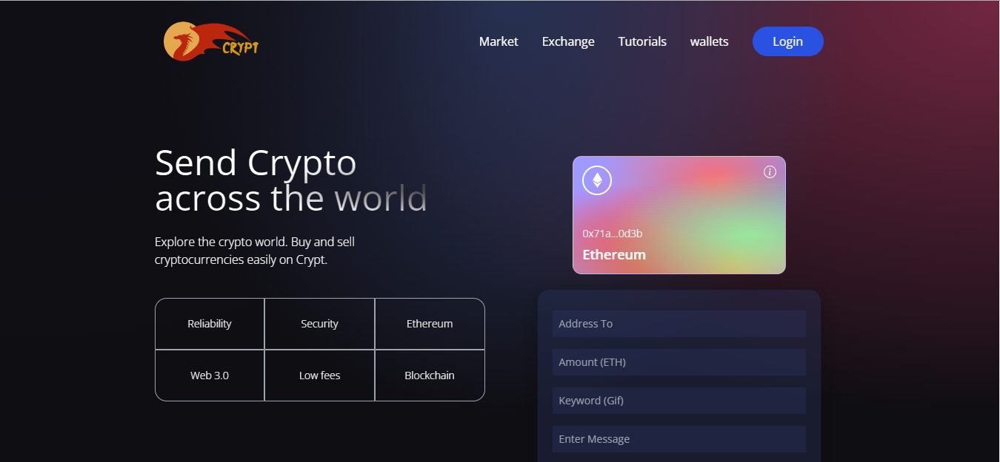

# Crypt 
> Blockchain Application(Web 3.0)



## Introduction

With a Stunning design, connected to the Blockchain, MetaMask pairing, interaction with Smart contracts,
sending Ethereum through the blockchain network, writing Solidity code, and much more,
Crypt is the best #Web3.0 #Blockchain application that you can currently find on GitHub👌👌👌

> [GitHub Code](https://github.com/yograjpaudel/web3.0) (give it a star ⭐)

### Documents Guide:

> file: client/.env
```
VITE_GIPHY_API=
VITE_ALCHEMY_API_KEY=
VITE_GOERLI_PRIVATE_KEY=
```

Vite | https://vitejs.dev/guide/
--- | ---
Tailwind Setup | https://tailwindcss.com/docs/guides/vite
MetaMask | download extention
Goerli | https://goerli.etherscan.io/
Alchemy | https://alchemy.com

> Influenced by [Adrian Hajdin - JS Mastery](https://github.com/adrianhajdin/project_web3.0)
